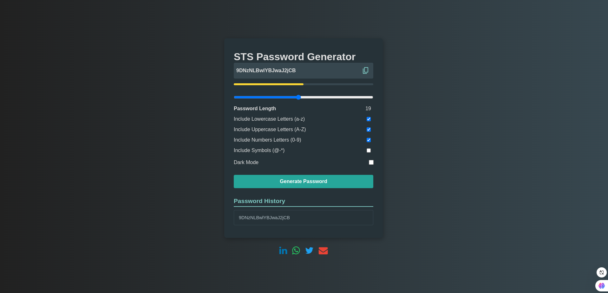

# STS Password Generator



## Description

Le **STS Password Generator** est une application web intuitive et performante qui génère des mots de passe sécurisés et personnalisables. Conçu pour les développeurs et les professionnels de la tech, il offre une interface moderne et des fonctionnalités robustes pour répondre à vos besoins en matière de sécurité.

---

## Fonctionnalités

- ✅ Génération de mots de passe personnalisés :
  - Lettres minuscules (a-z)
  - Lettres majuscules (A-Z)
  - Chiffres (0-9)
  - Symboles spéciaux (@, #, etc.)
- ✅ Indicateur de robustesse du mot de passe (faible, moyen, fort).
- ✅ Historique des mots de passe générés.
- ✅ Possibilité de copier rapidement le mot de passe.
- ✅ Ajustement dynamique de la longueur du mot de passe.
- ✅ Basculer entre thèmes clair et sombre.
- ✅ Design moderne adapté aux métiers de la tech.
- ✅ Versions minimisées des fichiers (`style.minify.css` et `script.minify.js`) pour des performances optimales.

---

## Installation

1. **Cloner le dépôt** :
   ```bash
   git clone https://github.com/DimitriTedom/STS-Password_Generator.git
   cd STS-Password_Generator
   ```

2. **Structure des fichiers** :
   ```
   ├── assets/
   │   ├── favicon.ico
   │   ├── preview.png
   │   ├── script.js
   │   ├── script.minify.js
   │   ├── style.css
   │   └── style.minify.css
   ├── index.html
   └── README.md
   ```

3. **Lancer l'application** :
   - Ouvrez `index.html` dans votre navigateur.

---

## Démonstration

Voici un aperçu rapide de l'interface utilisateur :


---

## Utilisation

1. **Choisissez vos options** :
   - Activez ou désactivez les options pour inclure des lettres majuscules, des chiffres, ou des symboles.
   - Ajustez la longueur du mot de passe à l'aide du slider.

2. **Générez un mot de passe** :
   - Cliquez sur le bouton "Generate Password".

3. **Copiez et sauvegardez vos mots de passe** :
   - Cliquez sur l'icône pour copier le mot de passe dans le presse-papiers.
   - Consultez l'historique pour retrouver vos mots de passe précédents.

---

## Technologies utilisées

- **HTML5**
- **CSS3** (dont `style.minify.css` pour un chargement rapide)
- **JavaScript** (dont `script.minify.js` pour des performances optimisées)
- **Google Icons** pour les icônes.

---

## Personnalisation

- Modifiez les couleurs ou les polices dans le fichier `style.css`.
- Ajoutez ou supprimez des symboles dans `script.js` pour ajuster la liste des caractères disponibles.
- Remplacez `favicon.ico` ou `preview.png` par vos propres images.

---

## Contribuer

Les contributions sont les bienvenues ! Pour proposer une amélioration :

1. Forkez le projet.
2. Créez une nouvelle branche : `git checkout -b feature/YourFeature`.
3. Soumettez vos modifications : `git commit -m "Add YourFeature"`.
4. Poussez la branche : `git push origin feature/YourFeature`.
5. Créez une Pull Request.

---

## Auteur

**Votre Nom ou Pseudo**  
[Twitter](https://x.com/DimitriTedom) • [LinkedIn](https://www.linkedin.com/in/tedom-tafotsi-dimitri-wilfried-b70502298/)

---

## Licence

Ce projet estdit mini car il a été réaliser sans framworks donc une licence gratuite tel que  **MIT**.


## Author 

- [Dimitri Tedom](https://github.com/DimitriTedom)